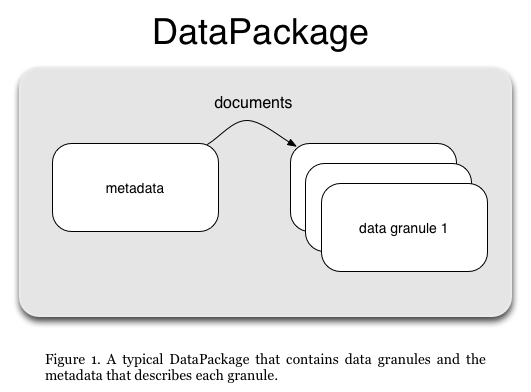
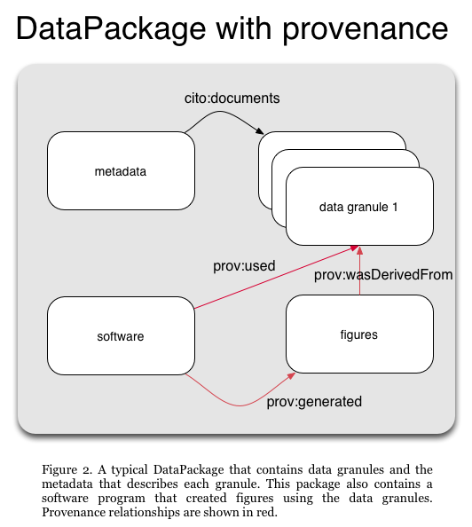

## Overview

The *datapack* R package provides an abstraction for collating multiple data 
objects of different types and metadata describing those objects into a bundle that can be transported and loaded using a single composite file.  It is primarily meant as
a container to bundle together files for transport to or from DataONE data repositories.

The methods in this package provide a convenient way to load data from common repositories 
such as DataONE into the R environment, and to document, serialize, and save data from R to 
data repositories. 

## Create a Single Object 
The *datapack* DataObject class is a wrapper that contains both data and system metadata that describes the data. 
The data can be either R `raw` data or a data file, for example a CSV file. The system metadata includes attributes such as the 
object identifier, type, size, checksum, owner, version relationship to other objects, access rules, and other critical metadata. The DataObject class also holds additional metadata about the data file. For example, where the file should go when someone downlaodeds the package. This is often times the same as the filepath however, care should be taken to not include any drive letters or unnecessary folders.

The following example shows how to create a DataObject locally from a CSV file:

```{r}
library(datapack)
library(uuid)
csvfile <- system.file("extdata/sample-data.csv", package="datapack")
myId <- paste("urn:uuid:", UUIDgenerate(), sep="")
myObj <- new("DataObject", id=myId, format="text/csv", filename=csvfile, relativeFilePath="extdata/sample-data.csv")
```

The DataObject `myObj` now contains the CSV data as well as the system-level 
information describing the file, such as its identifier, type, and checksum. 
The *getData* method can be used to extract the data content of a DataObject. 
Using the example DataObject:

```{r}
rawData <- getData(myObj)
```

This raw data can be converted back to CSV format using the R commands:

```{r,eval=FALSE}
tf <- tempfile(fileext=".csv")
write.csv(rawToChar(rawData), tf, quote=F, row.names=F)
```

Alternatively, the CSV data could be converted into a data frame using standard R
functions:

```{r}
df <- read.csv(textConnection(rawToChar(rawData)))
head(df)
```

If the data were another format than CSV, such as PNG, JPEG, or NetCDF, the 
corresponding R packages could be used to handle the object.

Each DataObject has an identifier which can be used to refer to that object, and 
is meant to be globally unique so that it can be used in data repositories such 
as those from the DataONE federation. To retrieve the identifier associated with
a DataObject:

```{r}
getIdentifier(myObj)
```

In this case, the identifier was created in the UUID format, but other identifiers
such as DOIs (Digital Object Identifers) can also be used.
Each object also is associated with a specific format. To retrieve the format type:

```{r}
getFormatId(myObj)
```

### System Metadata

All system metadata information for a DataObject can be accessed directly from the SystemMetadata object contained in the DataObject. To access the `fileName` field, for example:

```{r}
myObj@sysmeta@fileName
```

The system metadata contains access policy information for the DataObject that could be used
by a data repository that the object is uploaded to. For example, when a DataObject is
uploaded to a [DataONE Member Node](https://www.dataone.org/current-member-nodes), 
the access policy is applied to the uploaded data
and controls access to the data on the Member Node by DataONE users.

#### Access Policy

Before the DataObject is uploaded, access can be set so that anyone can read the uploaded data:
```{r}
myObj <- setPublicAccess(myObj)
myObj@sysmeta@accessPolicy
```

Individual access rules can also be added one at a time.  The access rules are expressed
using the unique identifier for an individual, such as their ORCID identity, or whatever
form the repository supports.
```{r}
myObj <- addAccessRule(myObj, "http://orcid.org/0000-0003-0077-4738", "write")
myObj@sysmeta@accessPolicy
```

The permissions that can be set include:

- read: permission to read the data from the repository
- write: permission to perform update operations on the data
- changePermission: permission to control access to the data on the repository

Alternatively, multiple access rules can be added:
```{r}
accessRules <- data.frame(subject=c("uid=jsmith,o=Account,dc=example,dc=com",  
                                    "uid=jadams,o=Account,dc=example,dc=org"), 
                          permission=c("write", "changePermission"))
myObj <- addAccessRule(myObj, accessRules)
myObj@sysmeta@accessPolicy
```

The *dataone* R package can be used to upload or download DataObjects to a DataONE Member Node.
Please see the web page for the [*dataone*](http://github.com/DataONEorg/rdataone) R package and the
vignettes for more information:

```{r, eval=FALSE}
library(dataone)
vignette("download-data", package="dataone")
vignette("upload-data", package="dataone")
```

## Create a Collection of Objects

A DataPackage is a container for a set of DataObjects. DataObject is a class that is a proxy for data of any type, including traditional data like CSV, tabular data, and spatial rasters, but also for non-traditional objects like derived data, figures, and scripts in R and Python. A collection of related DataObjects can be placed in a DataPackage and actions can be performed on it, such as serializing the entire collection of objects into a package file, or uploading all package member objects to a data repository.

Figure 1. is a diagram of a typical DataPackage showing a metadata file that
describes, or `documents` the data granules that the package contains.



This example creates a DataPackage with one DataObject containing metadata and two others containing science data. First the individual objects are created:

```{r}
metadataFile <- system.file("extdata/sample-eml.xml", package="datapack")
metadataId <- "metadataId"
metadataObj <- new("DataObject", id=metadataId, format="eml://ecoinformatics.org/eml-2.1.0", file=metadataFile)

csvfile <- system.file("extdata/sample-data.csv", package="datapack")
sciId <- "sciId1"
sciObj <- new("DataObject", id=sciId, format="text/csv", filename=csvfile)

outFile <- system.file("extdata/sample-data-filtered.csv", package="datapack")
sciId2 <- "sciId2"
sciObj2 <- new("DataObject", id=sciId2, filename=outFile, format="text/csv")
```

The identifier values used in this example are simple and easily recognizable for demonstration purposes. A more standard unique identifier can be created with the `uuid::UUIDgenerate()` function:

```{r}
myid <- paste("urn:uuid:", UUIDgenerate(), sep="")
myid
```

Next a DataPackage is created and the DataObjects are added to it. Note the `mo` argument in the `addMember` function when adding the data file. Including this argument specifies that the metadata object documents the data object. More information on relationships between DataObjects is included in the next section.
```{r}
dp <- new("DataPackage")
dp <- addMember(dp, do = metadataObj)
dp <- addMember(dp, do = sciObj, mo = metadataObj)
# The second object will be added in the next section 
```

Information can also be extracted from the DataPackage. To show the identifiers of the DataObjects that are in the package:

```{r}
getIdentifiers(dp)
```

To show the number of DataObjects in the package:
```{r}
getSize(dp)
```

To extract the data in a DataObject as raw data, ask for the data using the identifier of the DataObject:
```{r}
sciObjRaw <- getData(dp, sciId)
```

To get access to the full instance of the DataObject class representing a data object, 
use the `datapack::getMember` function and pass in the identifier of the desired object, 
which will return an instance of the DataObject class:
```{r}
mySciObj <- getMember(dp, sciId)
```

## Relationships Between DataObjects

The relationships between DataObjects in a DataPackage can be recorded in the DataPackage. 
For example, a typical relationship is that a DataObject containing a metadata 
document in a domain specific format such as Ecological Metadata Language (EML) 
or ISO19139 geospatial metadata can describe, or document, DataObjects containing 
associated science data. Adding relationship information about data package members 
may assist a consumer of the package in better understanding the contents of the 
package and how to make use of the package.

While the DataPackage can record any type of relationships that are important to
a community, we have provided functions to establish common relationships that 
are needed to understand scientific data in the DataONE federation.  These include 
the following typical provenance properties:

- `cito:documents`: for establishing that a metadata document provides descriptive
  information about one or more associated data objects
- `prov:wasDerivedFrom`: for asserting that a derived data object was created using 
  data from one or more source data objects
- `prov:used`: for asserting that when a program (such as an R script) was executed
  that it used one or more source data objects as inputs
- `prov:wasGeneratedBy`: for asserting that when a program (such as an R script) was executed
  that it generated one or more derived data objects as outputs
  
Figure 2. A DataPackage with provenance relationships.



### Linking a metadata file with one or more data files using cito:documents

As mentioned above, the fastest way to add the `cito:documents` relationship is to include the metadata object when a science data object is added to the package:

```{r}
dp <- addMember(dp, do = sciObj2, mo = metadataObj)
getRelationships(dp, condense=TRUE)
```

In that example, the `sciObj2` DataObject is added to the package using the `addMember` call, 
and the metadata object `metadataObj` is passed in to the function as well.  This
tells the DataPackage that `metadataId cito:documents sciId2`. The `cito:documents` relationship is defined by the [Citation Typing Ontology](http://purl.org/spar/cito) (CITO)).

## Asserting data provenance relationships between objects

Relationships that describe the processing history of package members can be added. For example,
a program that performs a modeling calculation might read one or more source data files as inputs,
perform  a calculation based on the data read, and then write a data or graphics file 
characterizing the results of the model run. 

The `datapack` package uses the [ProvONE](https://purl.dataone.org/provone-v1-dev) data model to represent provenance relationships.

The following example demonstrates how to insert provenance relationships into a DataPackage
for the R program `logit-regression.R` that reads the source data file `binary.csv` and 
generates the derived image file `gre-predicted.png`. Using the example DataPackage for which 
DataObjects for the program input and output have already been added, we create a 
DataObject for the program, and call `describeWorkflow` to add the necessary provenance
relationships:

```{r}
dp <- new("DataPackage")

metadataFile <- system.file("extdata/sample-eml.xml", package="datapack")
metadataId <- "metadataId"
metadataObj <- new("DataObject", id=metadataId, format="eml://ecoinformatics.org/eml-2.1.0", file=metadataFile)

# This DataObject contains the program script that was executed
progObj <- new("DataObject", format="application/R", 
           filename=system.file("extdata/pkg-example/logit-regression-example.R", package="datapack"))
dp <- addMember(dp, progObj, mo = metadataObj)

doIn <- new("DataObject", format="text/csv", 
             filename=system.file("./extdata/pkg-example/binary.csv", package="datapack"))
dp <- addMember(dp, doIn, mo = metadataObj)

doOut <- new("DataObject", format="image/png", 
             filename=system.file("./extdata/pkg-example/gre-predicted.png", package="datapack"))
dp <- addMember(dp, doOut, mo = metadataObj)

# The arguments "sources" and "derivations" can also contain lists of "DataObjects"
dp <- describeWorkflow(dp, sources=doIn, program=progObj, derivations=doOut)


rels <- getRelationships(dp, condense=TRUE)
rels[grepl("prov:", rels$predicate),]
```


```{r, message = FALSE, warning = FALSE, fig.width=8, fig.height=8}
library(igraph)
plotRelationships(dp)
```


Note that in this example, the R script had previously been run and generated the image
file before `describeWorkflow()` was called.  The `sources` and `derivations` arguments 
for `describeWorkflow()` can be lists of either DataObjects or the identifiers of DataObjects.


### Inserting other (arbitrary) relationships

Other types of relationships between DataPackage member DataObjects can be recorded with the `insertRelationship` method. The main requirement is that each relationship to be described
needs to have a unique URI that is drawn from a controlled vocabulary like the Citation Typing Ontology described above.  The `cito:documents` relationship is the default used by `insertRelationship`, so the relationship type doesn't need to be specified in this case. For example, with the example DataPackage created above, we can add the `cito:documents` relationship:

```{r}
dp <- insertRelationship(dp, subjectID=metadataId, objectIDs=sciId)
relations <- getRelationships(dp, condense=TRUE)
relations[grepl("cito:documents", relations$predicate),]
```

Relationships can be fully specified using the URI of the concept, as shown in the following statement that adds a provenance relationship between two objects in the example package:

```{r, eval=F}
dp <- insertRelationship(dp, subjectID=sciId2, objectIDs=sciId,
                   predicate="http://www.w3.org/ns/prov#wasDerivedFrom")
relations <- getRelationships(dp, condense=TRUE)
relations[grepl("prov:wasDerivedFrom", relations$predicate),]
``` 

The relationships contained in a DataPackage conform to the [Resource Description Framework](https://www.w3.org/RDF/) (RDF), which is a [World Wide Web Consortium](https://www.w3.org/)
standard for describing web accessible resources.

## Describing The Contents of a DataPackage 

In order to transport a DataPackage, for example to a data repository, a 
description of the contents of the DataPackage is created so that the consumer 
of the DataPackage can determine how to extract and process the contents.

A DataPackage can produce a standard description of its members and relationships 
which conforms to the Open Archives Initiative [Object Reuse and Exchange](https://www.openarchives.org/ore/) (OAI-ORE) specification, 
which is a widely used standard to describe aggregations of web accessible 
resources. This OAI-ORE description is referred to as a *resource map*.

The `serializePackage` method will create Resource Description Framework 
serialization of a resource map, written to a file in this case, that conforms 
to the OAI-ORE specification.

To create a resource map for the example DataPackage:

```{r, eval=FALSE}
tf <- tempfile()
packageId <- paste("urn:uuid:", UUIDgenerate(), sep="")
serializePackage(dp, file=tf, id=packageId)
```
This example writes to a tempfile using the default serialization format of 
"rdfxml". Also the URLs for each package member are prepended with the default 
value of the DataONE resolve service, which would be the URL that could be used 
to access this data object if the package is uploaded to a DataONE member node. 

A different value to be prepended to each identifier can be specified with the 
`resoveURI` argument. To specify that no value be prepended to the identifier 
URLs, specify a zero-length character:

```{r, eval=FALSE}
tf <- tempfile()
packageId <- paste("urn:uuid:", UUIDgenerate(), sep="")
serializePackage(dp, file=tf, id=packageId, resolveURI="")
```

It is also possible to create a JSON serialization, if desired:

```{r, eval=FALSE}
tf <- tempfile()
packageId <- paste("urn:uuid:", UUIDgenerate(), sep="")
serializePackage(dp, file=tf, id=packageId, syntaxName="json", mimeType="application/json", resolveURI="")
```

## Saving DataPackage Contents to a File

The contents of a DataPackage can be saved to a file using the `serializeToBagIt` 
method. This creates a *BagIt* file, which is a hierarchical file packaging format. 

The created BagIt file contains the data from the DataPackage members as well 
as an OAI-ORE resource map that is automatically created by `serializeToBagIt`.
 
The following R command shows how to create the BagIt file for the example DataPackage:

```{r, eval=F}
bagitFilename <- serializeToBagIt(dp)
```

The variable `bagitFilename` contains the file path to the temporary BagIt file.
This file should be copied to another location before quitting or restarting R:

```{r, eval=F}
file.copy(bagitFilename, "~/myPackageFile.zip")
```

This serialized BagIt version of the file is an excellent way to transport all 
of the files and metadata of a DataPackage to a data repository or a collaborator.

